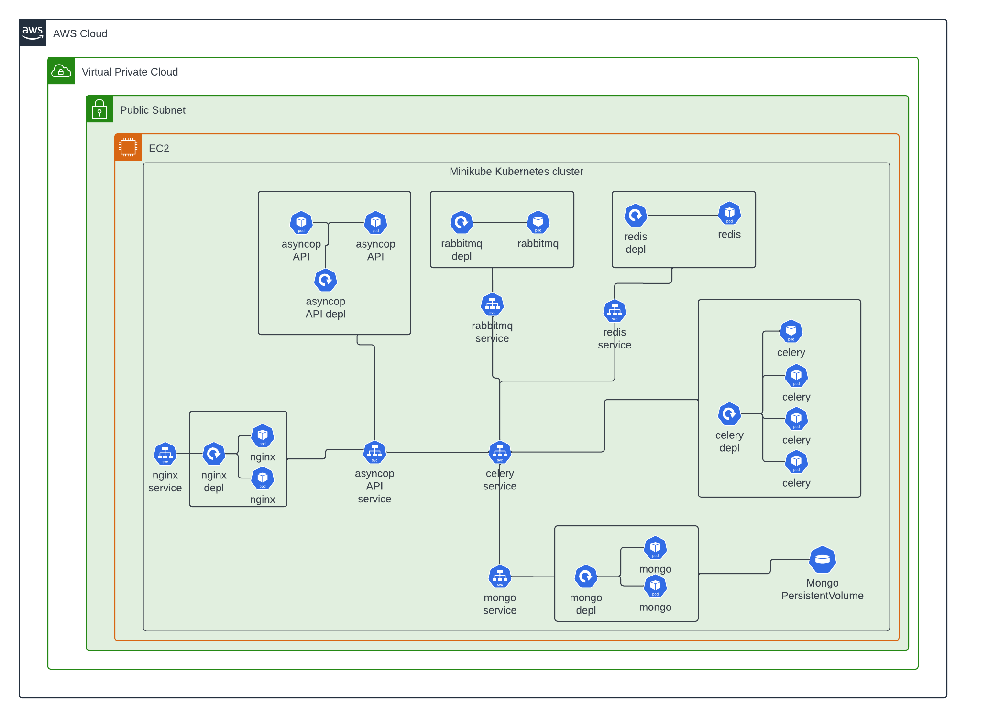

# FastAPI-Celery Example

## Author
- Kimba SABI N'GOYE

This project aims to develop an asynchronous order processing system using FastAPI. It involves implementing asynchronous endpoints for order management, background tasks for communication, human intervention tasks, state management, and advanced dashboard creation for process monitoring.

### How to Run the App

1. **Define Environment Variable `PROJECT_HOME`**
   - Make sure you have defined the `PROJECT_HOME` environment variable pointing to the root directory of your project.

2. **Execute `ec2/initial_setup.sh` Script**
   - Run the `initial_setup.sh` script located in the `ec2` directory to install the required dependencies and set up the environment.

3. **Execute `deploy-service.sh` Script**
   - Run the `deploy-service.sh` script to deploy the FastAPI app with Celery.

4. **Access the App**
   - Once deployed, the app port will be displayed. Use your host's IP address and the port to access the app in your web browser.
